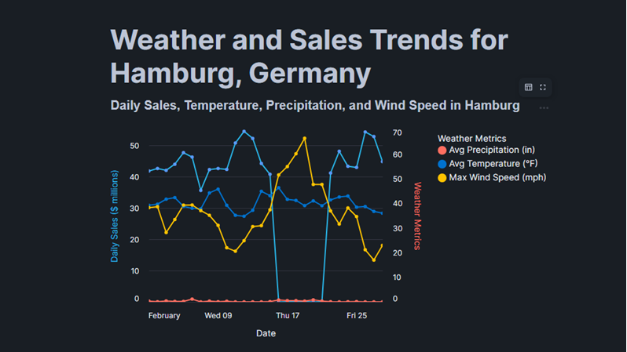

## Project Overview
**Project Title**: Weather App data pipeline in Snowflake

**Database**: `Tasty_Bytes`

Weather Application Data Pipeline is an end-to-end cloud data engineering project that demonstrates a modern ELT workflow using Amazon S3, Snowflake, and Streamlit. Raw weather data from the Pelmorex Weather Dataset is first stored in Amazon S3, then ingested and transformed within Snowflake to create analytics-ready datasets. Finally, the processed data is served through an interactive Streamlit application, enabling users to explore weather trends and insights through a web-based interface.

This project showcases key data engineering concepts including cloud storage integration, data warehousing, SQL-based transformations, and interactive data application development. It highlights how Snowflake can be used as a scalable analytics platform while Streamlit provides a lightweight interface for publishing analytical insights.



## Objectives
1. Build an End-to-End ELT Pipeline: Design and implement a cloud-based data pipeline that ingests raw weather data from Amazon S3 into Snowflake for centralized storage and processing.
2. Transform and Model Weather Data: Clean, transform, and structure raw weather data in Snowflake to create analytics-ready datasets using SQL.
3. Develop an Interactive Weather Application: Publish the processed weather data through a Streamlit application, enabling users to explore weather conditions and insights via an interactive web interface.

## Project Structure

### 1. Database setup & CSV Creation
```sql
-- Set role to ACCOUNTADMIN, and set compute resource (virtual warehouse) to COMPUTE_WH.
CREATE OR REPLACE DATABASE tasty_bytes;
CREATE OR REPLACE SCHEMA raw_pos;
````
### 2. Ingestion of Data from S3 to Country table 
```sql
---Load Sales Data From AWS S3
CREATE OR REPLACE STAGE tasty_bytes.public.s3load
url = 's3://sfquickstarts/tasty-bytes-builder-education/'
-- Specifying the file format 
file_format = tasty_bytes.public.csv_ff;

-- Creation of country table
CREATE OR REPLACE TABLE tasty_bytes.raw_pos.country
(
   country_id NUMBER(18,0),
   country VARCHAR(16777216),
   iso_currency VARCHAR(3),
   iso_country VARCHAR(2),
   city_id NUMBER(19,0),
   city VARCHAR(16777216),
   city_population VARCHAR(16777216)
);

--COPY INTO command to load data into the country table:
COPY INTO tasty_bytes.raw_pos.country
FROM @tasty_bytes.public.s3load/raw_pos/country/;
```
### 4. Setup Tables
```sql
USE ROLE accountadmin;
USE DATABASE tasty_bytes;

/*--
database, schema and warehouse creation
--*/

-- create raw_customer schema
CREATE OR REPLACE SCHEMA tasty_bytes.raw_customer;

-- create harmonized schema
CREATE OR REPLACE SCHEMA tasty_bytes.harmonized;

-- create analytics schema
CREATE OR REPLACE SCHEMA tasty_bytes.analytics;

-- create warehouse for ingestion
CREATE OR REPLACE WAREHOUSE demo_build_wh
   WAREHOUSE_SIZE = 'xlarge'
   WAREHOUSE_TYPE = 'standard'
   AUTO_SUSPEND = 60
   AUTO_RESUME = TRUE
   INITIALLY_SUSPENDED = TRUE;

/*--
file format and stage creation
--*/

CREATE OR REPLACE FILE FORMAT tasty_bytes.public.csv_ff
type = 'csv';


CREATE OR REPLACE STAGE tasty_bytes.public.s3load
url = 's3://sfquickstarts/tasty-bytes-builder-education/'
file_format = tasty_bytes.public.csv_ff;

/*--
raw zone table build
--*/

-- franchise table build
CREATE OR REPLACE TABLE tasty_bytes.raw_pos.franchise
(
   franchise_id NUMBER(38,0),
   first_name VARCHAR(16777216),
   last_name VARCHAR(16777216),
   city VARCHAR(16777216),
   country VARCHAR(16777216),
   e_mail VARCHAR(16777216),
   phone_number VARCHAR(16777216)
);

-- location table build
CREATE OR REPLACE TABLE tasty_bytes.raw_pos.location
(
   location_id NUMBER(19,0),
   placekey VARCHAR(16777216),
   location VARCHAR(16777216),
   city VARCHAR(16777216),
   region VARCHAR(16777216),
   iso_country_code VARCHAR(16777216),
   country VARCHAR(16777216)
);

-- menu table build
CREATE OR REPLACE TABLE tasty_bytes.raw_pos.menu
(
   menu_id NUMBER(19,0),
   menu_type_id NUMBER(38,0),
   menu_type VARCHAR(16777216),
   truck_brand_name VARCHAR(16777216),
   menu_item_id NUMBER(38,0),
   menu_item_name VARCHAR(16777216),
   item_category VARCHAR(16777216),
   item_subcategory VARCHAR(16777216),
   cost_of_goods_usd NUMBER(38,4),
   sale_price_usd NUMBER(38,4),
   menu_item_health_metrics_obj VARIANT
);

-- truck table build
CREATE OR REPLACE TABLE tasty_bytes.raw_pos.truck
(
   truck_id NUMBER(38,0),
   menu_type_id NUMBER(38,0),
   primary_city VARCHAR(16777216),
   region VARCHAR(16777216),
   iso_region VARCHAR(16777216),
   country VARCHAR(16777216),
   iso_country_code VARCHAR(16777216),
   franchise_flag NUMBER(38,0),
   year NUMBER(38,0),
   make VARCHAR(16777216),
   model VARCHAR(16777216),
   ev_flag NUMBER(38,0),
   franchise_id NUMBER(38,0),
   truck_opening_date DATE
);


-- order_header table build
CREATE OR REPLACE TABLE tasty_bytes.raw_pos.order_header
(
   order_id NUMBER(38,0),
   truck_id NUMBER(38,0),
   location_id FLOAT,
   customer_id NUMBER(38,0),
   discount_id VARCHAR(16777216),
   shift_id NUMBER(38,0),
   shift_start_time TIME(9),
   shift_end_time TIME(9),
   order_channel VARCHAR(16777216),
   order_ts TIMESTAMP_NTZ(9),
   served_ts VARCHAR(16777216),
   order_currency VARCHAR(3),
   order_amount NUMBER(38,4),
   order_tax_amount VARCHAR(16777216),
   order_discount_amount VARCHAR(16777216),
   order_total NUMBER(38,4)
);


-- order_detail table build
CREATE OR REPLACE TABLE tasty_bytes.raw_pos.order_detail
(
   order_detail_id NUMBER(38,0),
   order_id NUMBER(38,0),
   menu_item_id NUMBER(38,0),
   discount_id VARCHAR(16777216),
   line_number NUMBER(38,0),
   quantity NUMBER(5,0),
   unit_price NUMBER(38,4),
   price NUMBER(38,4),
   order_item_discount_amount VARCHAR(16777216)
);


-- customer loyalty table build
CREATE OR REPLACE TABLE tasty_bytes.raw_customer.customer_loyalty
(
   customer_id NUMBER(38,0),
   first_name VARCHAR(16777216),
   last_name VARCHAR(16777216),
   city VARCHAR(16777216),
   country VARCHAR(16777216),
   postal_code VARCHAR(16777216),
   preferred_language VARCHAR(16777216),
   gender VARCHAR(16777216),
   favourite_brand VARCHAR(16777216),
   marital_status VARCHAR(16777216),
   children_count VARCHAR(16777216),
   sign_up_date DATE,
   birthday_date DATE,
   e_mail VARCHAR(16777216),
   phone_number VARCHAR(16777216)
);


/*--
harmonized view creation
--*/


-- orders_v view
CREATE OR REPLACE VIEW tasty_bytes.harmonized.orders_v
   AS
SELECT
   oh.order_id,
   oh.truck_id,
   oh.order_ts,
   od.order_detail_id,
   od.line_number,
   m.truck_brand_name,
   m.menu_type,
   t.primary_city,
   t.region,
   t.country,
   t.franchise_flag,
   t.franchise_id,
   f.first_name AS franchisee_first_name,
   f.last_name AS franchisee_last_name,
   l.location_id,
   cl.customer_id,
   cl.first_name,
   cl.last_name,
   cl.e_mail,
   cl.phone_number,
   cl.children_count,
   cl.gender,
   cl.marital_status,
   od.menu_item_id,
   m.menu_item_name,
   od.quantity,
   od.unit_price,
   od.price,
   oh.order_amount,
   oh.order_tax_amount,
   oh.order_discount_amount,
   oh.order_total
FROM tasty_bytes.raw_pos.order_detail od
JOIN tasty_bytes.raw_pos.order_header oh
   ON od.order_id = oh.order_id
JOIN tasty_bytes.raw_pos.truck t
   ON oh.truck_id = t.truck_id
JOIN tasty_bytes.raw_pos.menu m
   ON od.menu_item_id = m.menu_item_id
JOIN tasty_bytes.raw_pos.franchise f
   ON t.franchise_id = f.franchise_id
JOIN tasty_bytes.raw_pos.location l
   ON oh.location_id = l.location_id
LEFT JOIN tasty_bytes.raw_customer.customer_loyalty cl
   ON oh.customer_id = cl.customer_id;


-- loyalty_metrics_v view
CREATE OR REPLACE VIEW tasty_bytes.harmonized.customer_loyalty_metrics_v
   AS
SELECT
   cl.customer_id,
   cl.city,
   cl.country,
   cl.first_name,
   cl.last_name,
   cl.phone_number,
   cl.e_mail,
   SUM(oh.order_total) AS total_sales,
   ARRAY_AGG(DISTINCT oh.location_id) AS visited_location_ids_array
FROM tasty_bytes.raw_customer.customer_loyalty cl
JOIN tasty_bytes.raw_pos.order_header oh
ON cl.customer_id = oh.customer_id
GROUP BY cl.customer_id, cl.city, cl.country, cl.first_name,
cl.last_name, cl.phone_number, cl.e_mail;


/*--
analytics view creation
--*/


-- orders_v view
CREATE OR REPLACE VIEW tasty_bytes.analytics.orders_v
COMMENT = 'Tasty Bytes Order Detail View'
   AS
SELECT DATE(o.order_ts) AS date, * FROM tasty_bytes.harmonized.orders_v o;


-- customer_loyalty_metrics_v view
CREATE OR REPLACE VIEW tasty_bytes.analytics.customer_loyalty_metrics_v
COMMENT = 'Tasty Bytes Customer Loyalty Member Metrics View'
   AS
SELECT * FROM tasty_bytes.harmonized.customer_loyalty_metrics_v;


/*--
raw zone table load
--*/


USE WAREHOUSE demo_build_wh;


-- franchise table load
COPY INTO tasty_bytes.raw_pos.franchise
FROM @tasty_bytes.public.s3load/raw_pos/franchise/;

-- location table load
COPY INTO tasty_bytes.raw_pos.location
FROM @tasty_bytes.public.s3load/raw_pos/location/;


-- menu table load
COPY INTO tasty_bytes.raw_pos.menu
FROM @tasty_bytes.public.s3load/raw_pos/menu/;


-- truck table load
COPY INTO tasty_bytes.raw_pos.truck
FROM @tasty_bytes.public.s3load/raw_pos/truck/;


-- customer_loyalty table load
COPY INTO tasty_bytes.raw_customer.customer_loyalty
FROM @tasty_bytes.public.s3load/raw_customer/customer_loyalty/;


-- order_header table load
COPY INTO tasty_bytes.raw_pos.order_header
FROM @tasty_bytes.public.s3load/raw_pos/order_header/;


-- order_detail table load
COPY INTO tasty_bytes.raw_pos.order_detail
FROM @tasty_bytes.public.s3load/raw_pos/order_detail/;


DROP WAREHOUSE demo_build_wh;
```
### 4. Data Exploration
``` sql
USE ROLE accountadmin;
USE WAREHOUSE compute_wh;
USE DATABASE tasty_bytes;

-- Query to explore sales in the city of Hamburg, Germany
WITH _feb_date_dim AS (
    SELECT DATEADD(DAY, SEQ4(), '2022-02-01') AS date 
    FROM TABLE(GENERATOR(ROWCOUNT => 28))
)
SELECT
    fdd.date,
    ZEROIFNULL(SUM(o.price)) AS daily_sales
FROM _feb_date_dim fdd
LEFT JOIN analytics.orders_v o
    ON fdd.date = DATE(o.order_ts)
    AND o.country = '#' -- Add country
    AND o.primary_city = '#' -- Add city
WHERE fdd.date BETWEEN '2022-02-01' AND '2022-02-28'
GROUP BY fdd.date
ORDER BY fdd.date ASC;

-- Create view that adds weather data for cities where Tasty Bytes operates
CREATE OR REPLACE VIEW tasty_bytes.harmonized.daily_weather_v
COMMENT = 'Weather Source Daily History filtered to Tasty Bytes supported Cities'
    AS
SELECT
    hd.*,
    TO_VARCHAR(hd.date_valid_std, 'YYYY-MM') AS yyyy_mm,
    pc.city_name AS city,
    c.country AS country_desc
FROM Pelmorex_Weather_Source_frostbyte.onpoint_id.history_day hd
JOIN Pelmorex_Weather_Source_frostbyte.onpoint_id.postal_codes pc
    ON pc.postal_code = hd.postal_code
    AND pc.country = hd.country
JOIN TASTY_BYTES.raw_pos.country c
    ON c.iso_country = hd.country
    AND c.city = hd.city_name;

-- Query the view to explore daily temperatures in Hamburg, Germany for anomalies
SELECT
    dw.country_desc,
    dw.city_name,
    dw.date_valid_std,
    AVG(dw.avg_temperature_air_2m_f) AS avg_temperature_air_2m_f
FROM harmonized.daily_weather_v dw
WHERE 1=1
    AND dw.country_desc = 'Germany'
    AND dw.city_name = 'Hamburg'
    AND YEAR(date_valid_std) = '2022'
    AND MONTH(date_valid_std) = '2' -- February
GROUP BY dw.country_desc, dw.city_name, dw.date_valid_std
ORDER BY dw.date_valid_std DESC;

-- Query the view to explore wind speeds in Hamburg, Germany for anomalies
SELECT
    dw.country_desc,
    dw.city_name,
    dw.date_valid_std,
    MAX(dw.max_wind_speed_100m_mph) AS max_wind_speed_100m_mph
FROM tasty_bytes.harmonized.daily_weather_v dw
WHERE 1=1
    AND dw.country_desc IN ('Germany')
    AND dw.city_name = 'Hamburg'
    AND YEAR(date_valid_std) = '2022'
    AND MONTH(date_valid_std) = '2' -- February
GROUP BY dw.country_desc, dw.city_name, dw.date_valid_std
ORDER BY dw.date_valid_std DESC;

-- Create a view that tracks windspeed for Hamburg, Germany
CREATE OR REPLACE VIEW tasty_bytes.harmonized.hamburg_wind_speed_v--add name of view
    AS
SELECT
    dw.country_desc,
    dw.city_name,
    dw.date_valid_std,
    MAX(dw.max_wind_speed_100m_mph) AS max_wind_speed_100m_mph
FROM harmonized.daily_weather_v dw
WHERE 1=1
    AND dw.country_desc IN ('Germany')
    AND dw.city_name = 'Hamburg'
GROUP BY dw.country_desc, dw.city_name, dw.date_valid_std
ORDER BY dw.date_valid_std DESC;
````

### 5. Insights/Inquaries
```sql
What will the weather be like in Boston next weekend?
/*
Our food truck is scheduled to be at a sporting event in Boston next weekend. Can you tell me the forecasted weather so we can anticipate footfall traffic and prepare food accordingly?
*/
SELECT
    postal_code,
    country,
    date_valid_std,
    avg_temperature_air_2m_f,
    avg_humidity_relative_2m_pct,
    avg_wind_speed_10m_mph,
    tot_precipitation_in,
    tot_snowfall_in,
    avg_cloud_cover_tot_pct,
    probability_of_precipitation_pct,
    probability_of_snow_pct
FROM
(
    SELECT
        postal_code,
        country,
        date_valid_std,
        avg_temperature_air_2m_f,
        avg_humidity_relative_2m_pct,
        avg_wind_speed_10m_mph,
        tot_precipitation_in,
        tot_snowfall_in,
        avg_cloud_cover_tot_pct,
        probability_of_precipitation_pct,
        probability_of_snow_pct,
        DATEADD(DAY,2,CURRENT_DATE()) AS skip_date,
        DATEADD(DAY,7 - DAYOFWEEKISO(skip_date),skip_date) AS next_sunday,
        DATEADD(DAY,-1,next_sunday) AS next_saturday
    FROM
        onpoint_id.forecast_day
    WHERE
        postal_code = '02201' AND
        country = 'US'
)
WHERE
    date_valid_std IN (next_saturday,next_sunday)
ORDER BY
    date_valid_std
;

// We are looking  for new locations for our food trucks in Paris.
/*
We would like to find new locations for our food trucks in Paris. Can we look at last year’s weather in Paris to choose the best location?
*/
SELECT
    postal_code,
    country,
    date_valid_std,
    avg_temperature_air_2m_f,
    avg_humidity_relative_2m_pct,
    avg_wind_speed_10m_mph,
    tot_precipitation_in,
    tot_snowfall_in,
    avg_cloud_cover_tot_pct
FROM
    onpoint_id.history_day
WHERE
    postal_code = '75008' AND
    country = 'FR' AND
    date_valid_std = DATEADD(year,-1,CURRENT_DATE)
;

// What is the temperature in London during May?
/*
We would like to look at the temperatures in May of last year to determine when to rotate seasonal menu items.
*/
SELECT
    postal_code,
    country,
    date_valid_std,
    min_temperature_air_2m_f,
    avg_temperature_air_2m_f,
    max_temperature_air_2m_f
FROM
    onpoint_id.history_day
WHERE
    postal_code = 'SW1A 0AA' AND
    country = 'GB' AND
    date_valid_std BETWEEN DATE_FROM_PARTS(YEAR(CURRENT_DATE)-1,5,1) AND DATE_FROM_PARTS(YEAR(CURRENT_DATE)-1,5,31)
ORDER BY
    date_valid_std
;

// What will the temperature in Tokyo be next Saturday?
/*
Our food truck is catering an outdoor party in Tokyo next Saturday? Can you tell me the forecasted temperatures so we can determine our menu items?
*/
SELECT
    postal_code,
    country,
    date_valid_std,
    min_temperature_air_2m_f,
    avg_temperature_air_2m_f,
    max_temperature_air_2m_f
FROM
(
    SELECT
        postal_code,
        country,
        date_valid_std,
        min_temperature_air_2m_f,
        avg_temperature_air_2m_f,
        max_temperature_air_2m_f,
        DATEADD(DAY,2,CURRENT_DATE()) AS skip_date,
        DATEADD(DAY,6 - DAYOFWEEKISO(skip_date),skip_date) AS next_saturday
    FROM
        onpoint_id.forecast_day
    WHERE
        postal_code = '102-0082' AND
        country = 'JP'
)
WHERE
    date_valid_std = next_saturday
;

// I would like to look at last year's weather in Sydney from September - November.
// We would like to look at the weather last year from September to November in Sydney so we can determine the best location to park our food truck during those months.
SELECT
    postal_code,
    country,
    date_valid_std,
    avg_temperature_air_2m_f,
    avg_humidity_relative_2m_pct,
    avg_wind_speed_10m_mph,
    tot_precipitation_in,
    tot_snowfall_in,
    avg_cloud_cover_tot_pct
FROM
    onpoint_id.history_day
WHERE
    postal_code = '2000' AND
    country = 'AU' AND
    date_valid_std BETWEEN DATE_FROM_PARTS(YEAR(CURRENT_DATE)-1,9,1) AND DATE_FROM_PARTS(YEAR(CURRENT_DATE)-1,11,30)
ORDER BY
    date_valid_std
;

```


